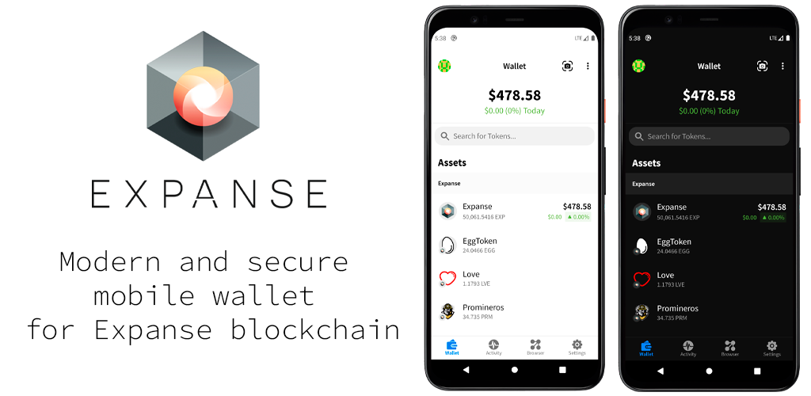

# ExpanseWallet - modern and secure mobile wallet for Expanse blockchain.

Expanse Wallet is a modern and secure mobile wallet, that has been built on top of [AlphaWallet](https://github.com/AlphaWallet/alpha-wallet-android) project to provide easy access to your Expanse's assets.

⭐ Star us on GitHub — it helps!

## About ExpanseWallet - Features

Easy to use and secure open source Expanse wallet for Android, with native ERC20, ERC721, ERC1155 and ERC875 support.

- Beginner Friendly
- Secure Enclave Security
- Web3 dApp Browser
- Interact with DeFi, DAO and Games with SmartTokens
- No hidden fees or tech background needed

### ExpanseWallet Is A Token Wallet

ExpanseWallet's focus is to provide an interface to interact with Expanse Tokens in an intuitive, simple and full featured manner.

### Philosophy
ExpanseWallet - uses the best parts from AlphaWallet to provide Expanse community best practices.

AlphaWallet is founded by blockchain geeks, business professionals who believe blockchain technology will have a massive impact on the future and change the landscape of technology in general.

We are committed to connecting businesses and consumers with the new digital economic infrastructure through tokenisation. Tokenised rights can be traded on the market and integrated across systems, forming a Frictionless Market and allowing limitless integration with the web.

We want to give businesses the whitelabel tools they need to develop their ethereum wallets, and join the tokenised economy.

# Getting Started

1. [Download](https://developer.android.com/studio/) Android Studio.
2. Clone this repository
4. Build the project in AndroidStudio or Run `./gradlew build` to install tools and dependencies. See [BUILD.md](BUILD.md) for more details.

You can also build it from the commandline just like other Android apps. Note that JDK 8 and 11 are the versions supported by Android.

Find more information in our available [documentation](https://github.com/DimmOFF/expanse-wallet-android/blob/master/docs/overview.md).

### Add dApp to the “Discover dApps” section in the browser

Submit a PR to the following file:
https://github.com/DimmOFF/expanse-wallet-android/blob/master/app/src/main/assets/dapps_list.json

## How to Contribute

You can submit feedback and report bugs as Github issues. Please be sure to include your operating system, device, version number, and steps to reproduce reported bugs.

To learn more about Expanse, please check our website or join the community:
- [Expanse](https://Expanse.tech)
- [Telegram](https://t.me/ExpanseTech)
- [Discord](https://discord.gg/DUN6r2X)

## License
ExpanseWallet Android is available under the [MIT license](https://github.com/DimmOFF/expanse-wallet-android/blob/master/LICENSE). Free for commercial and non-commercial use.
